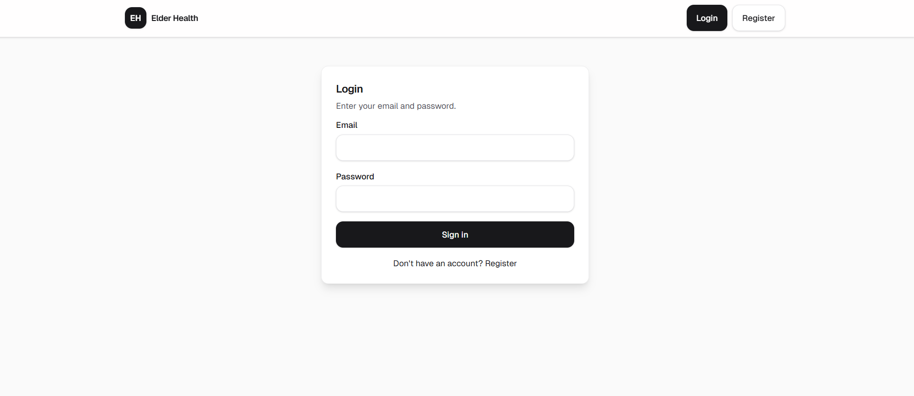
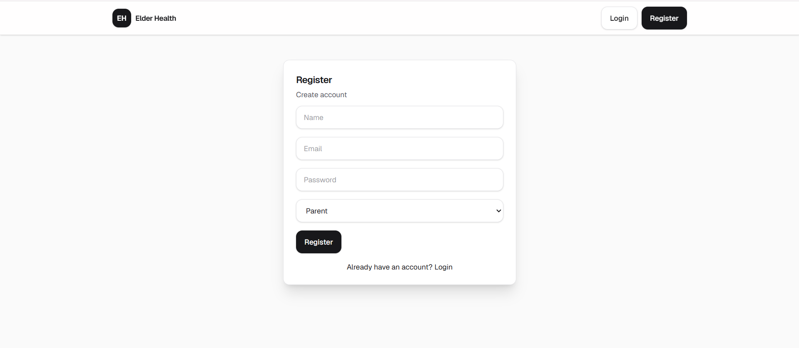
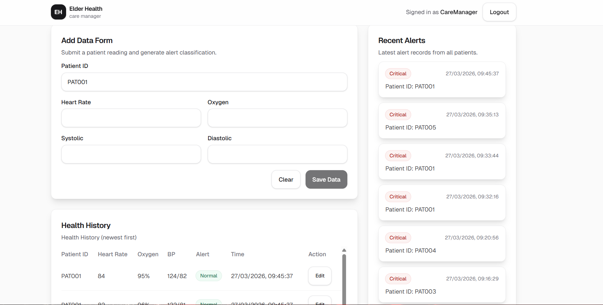
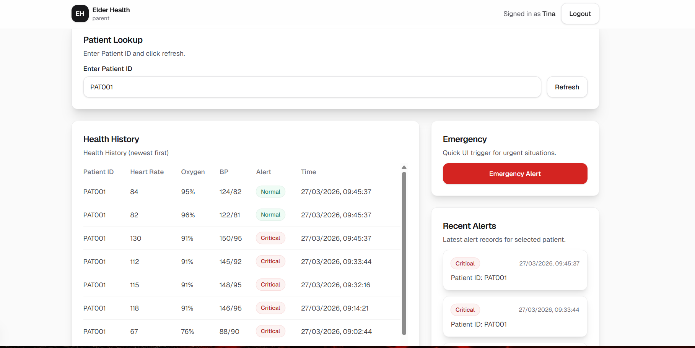
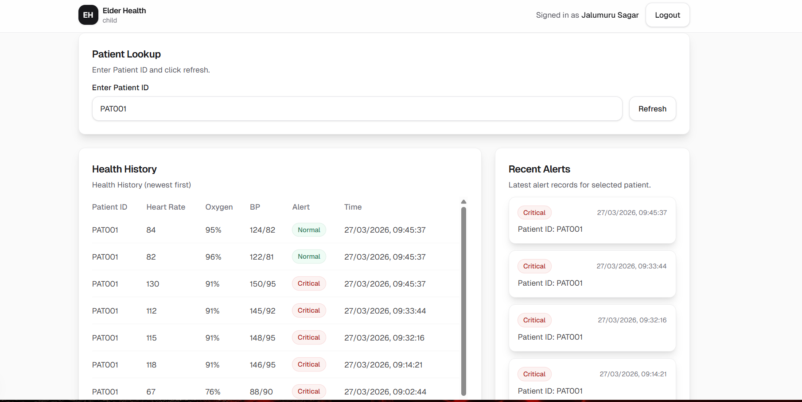
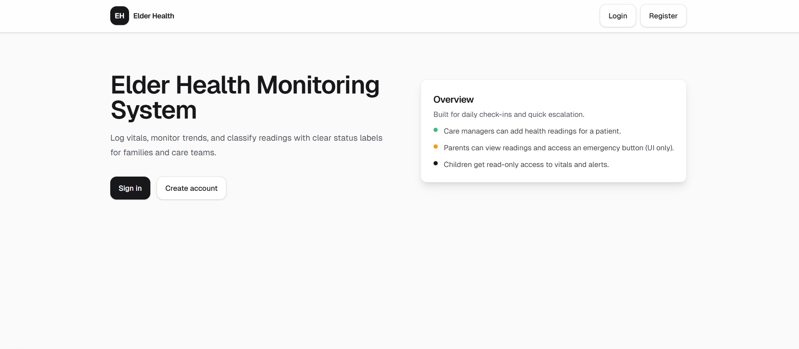

# 🩺 Elder Health Monitoring System

A full-stack web application to monitor elderly health with **secure authentication, role-based dashboards, real-time alerts, and health history tracking**.

---

## 🚀 Tech Stack

### 🔹 Backend

* ⚙️ Node.js
* 🚀 Express.js
* 🍃 MongoDB (Mongoose)
* 🔐 JWT Authentication
* 🔒 bcrypt

### 🔹 Frontend

* ⚛️ Next.js (App Router)
* 🎨 Tailwind CSS
* 🔄 TanStack Query
* 🌐 Axios

---

## 🔐 Features

* 🔑 Authentication (Login/Register)
* 👥 Role-based dashboards
* 📊 Health monitoring system
* 🚨 Alert classification
* ✏️ Edit & update health records
* ⚡ Emergency button (UI simulation)

---

## 📊 Alert Logic

* 🔴 Oxygen < 92 → Critical
* 🟡 Heart Rate < 50 or > 110 → Alert
* 🟠 BP > 140/90 → Warning
* 🟢 Otherwise → Normal

---

# 📸 Screenshots

---

## 🔐 Login Page



---

## 📝 Registration Page



---

## 👨‍⚕️ Care Manager Dashboard



---

## 👨‍👩‍👧 Parent Dashboard



---

## 👶 Child Dashboard



---

## 📊 Main Dashboard



---

## ⚙️ Installation

### Clone Repo

```bash
git clone https://github.com/jalumuru-sagar/elder-health-app.git
cd elder-health-app
```

---

### Backend Setup

```bash
cd backend
copy .env.example .env
```

Add:

```
MONGODB_URI=your_mongodb_url
JWT_SECRET=your_secret
CLIENT_ORIGIN=http://localhost:3000
```

Run:

```bash
npm install
npm run dev
```

---

### Frontend Setup

```bash
cd frontend
copy .env.example .env.local
```

Add:

```
NEXT_PUBLIC_API_URL=http://localhost:5000
```

Run:

```bash
npm install
npm run dev
```

---

## ▶️ Run Project

* Frontend → http://localhost:3000
* Backend → http://localhost:5000/healthz

---

## 🌐 Deployment

### Backend → Render

### Frontend → Vercel

---

## 💡 Highlights

* 🔐 Secure JWT Authentication
* 📊 Real-time health tracking
* 🎯 Role-based access
* 🧠 Smart alert system
* ✏️ Editable records

---

## 👨‍💻 Author

**Jalumuru Sagar**

---
